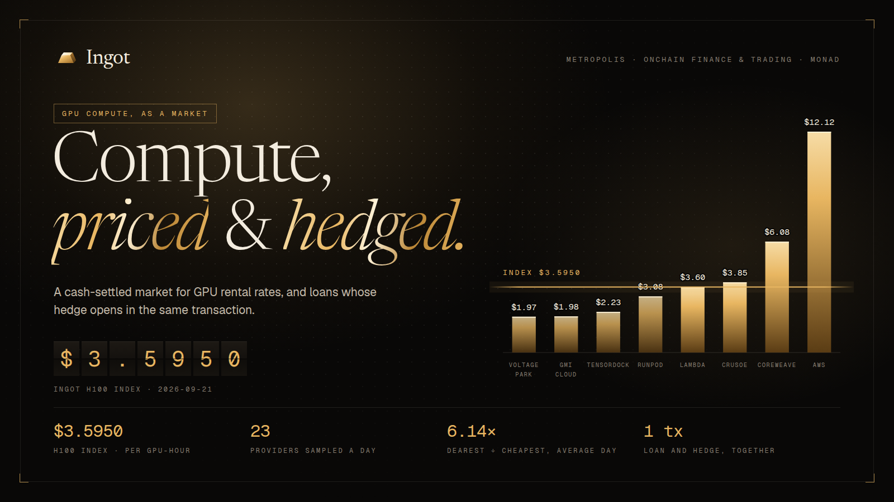
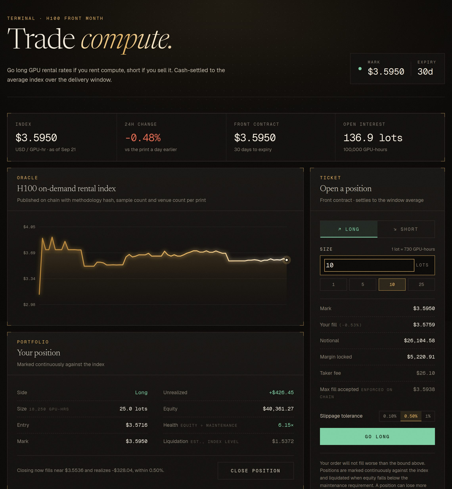
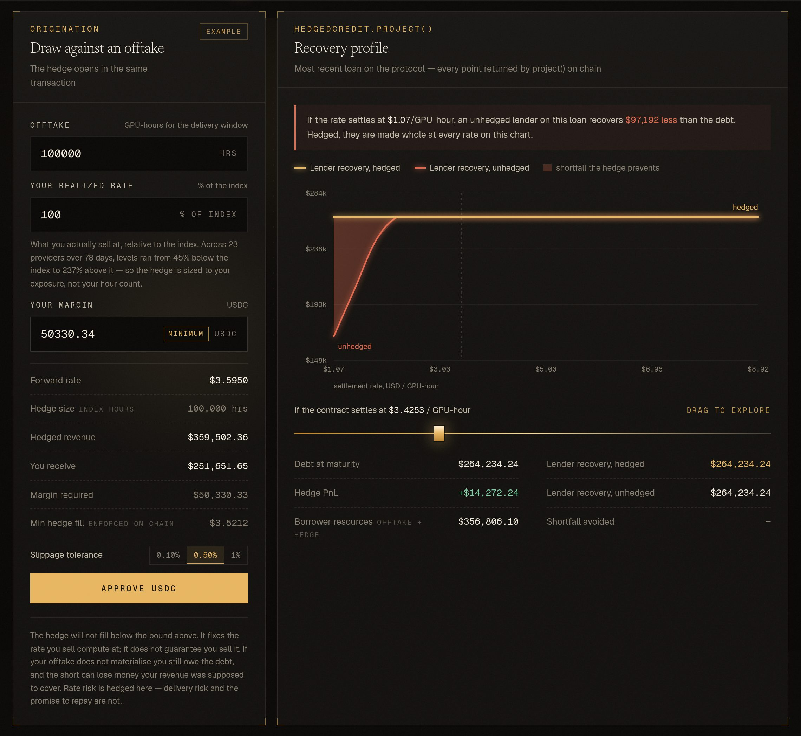
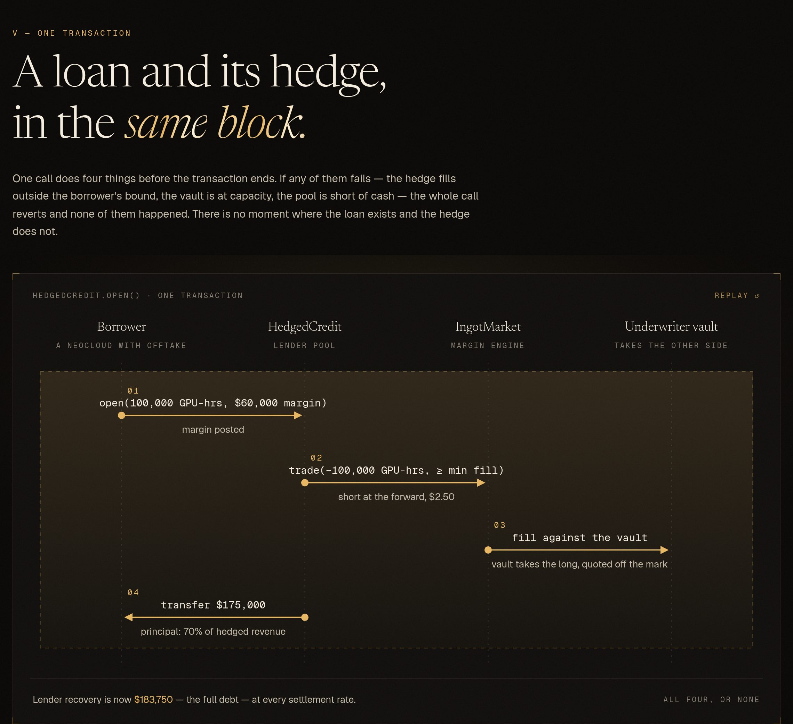

# Ingot



**A cash-settled market for compute, and the credit layer it unlocks.**

Built for Metropolis — Onchain Finance & Trading track. Deployed on Monad.

---

## The problem

Compute is one of the most valuable commodities in the world and it trades like a private
handshake. NVIDIA H100 rentals have been observed between **$0.72 and $15.14 per GPU-hour on the
same day** across two dozen marketplaces. There is no forward curve, no hedge, and almost no
secondary market — publicly documented secondary GPU transactions total roughly **$26.3M**.

That missing hedge has a price, and it lands on credit. CoreWeave borrows at **+225bps against a
hyperscaler counterparty and +450–550bps against a weaker one — on identical hardware.** The
spread is not hardware risk. It is unhedgeable cash-flow risk, and it is repriced on tens of
billions of dollars of GPU-backed debt.

On **October 5, 2026**, CME lists Silicon Data H100 and B200 Rental Index futures: 730 GPU-hours
per contract, financially settled. Compute is now, officially, a commodity. But that contract is
NYMEX-cleared, FCM-gated and US-regulated — closed to the neoclouds, brokers and AI startups who
actually carry the exposure, across 40+ countries.

## What Ingot is

1. **An index.** An onchain rental-rate index for a standardized compute unit, published with its
   methodology hash, sample count and venue count on every print. Prints are provisional before
   they are settleable, so a bad scrape can be revoked before money moves against it.
2. **A market.** Cash-settled swaps on that index, in CME-parity 730 GPU-hour lots, with liquidity
   underwritten by a vault rather than by hope.
3. **A margin engine** that marks continuously against the index instead of once a day — which is
   only economical at Monad's sub-cent gas and 800ms finality.
4. **Hedged credit.** The part that does not exist anywhere, onchain or off: a loan against compute
   revenue where the offsetting hedge is opened *at origination*, so the lender underwrites a fixed
   cash flow instead of a GPU price forecast. The hedge is not a separate product the borrower has
   to go buy — it is part of the loan.

## Product tour

Captured from the production build against a local chain seeded with the real 78-day index
history.

**The terminal.** The index as published on chain, a ticket that shows the fill, margin, fee and
the on-chain price bound before you sign, and a live position marked against the index.



**The credit desk.** Draw against an offtake and the hedge opens in the same transaction. The
recovery profile on the right is `HedgedCredit.project()` read point by point: the hedged lender
is made whole at every settlement rate; the unhedged one is not.



**One transaction.** What `HedgedCredit.open()` does before the block closes. If any step fails,
none of them happened.



## Trying it

[**docs/JUDGES.md**](docs/JUDGES.md) is the five-minute walkthrough: test funds, the three
flows, and how to check each claim against the chain or the test suite. No login, no setup beyond
a wallet and testnet gas.

## Documentation

| | |
|---|---|
| [`docs/JUDGES.md`](docs/JUDGES.md) | Five-minute walkthrough for judges |
| [`docs/BACKTEST.md`](docs/BACKTEST.md) | 78 days of real H100 prices: method, findings, and the negative result |
| [`docs/SECURITY.md`](docs/SECURITY.md) | What the protocol trusts, what was fixed, what was accepted |
| [`docs/ORACLE.md`](docs/ORACLE.md) | The index publisher as a Chainlink CRE workflow |
| [`docs/INDEXER.md`](docs/INDEXER.md) | The Envio HyperIndex data layer, and how it is proven against the contracts |
| [`docs/DEPLOY.md`](docs/DEPLOY.md) | Deploying contracts and hosting the front end |
| [`docs/VIDEO-SCRIPTS.md`](docs/VIDEO-SCRIPTS.md) | Demo and pitch scripts |
| [`docs/brand/`](docs/brand) | Logo, cover, mark and the script that renders them |

## Repository layout

```
contracts/      Foundry workspace — index, market, vault, credit
  src/          Contracts
  test/         Test suite
  script/       Deployment and seeding
web/            Next.js front end — terminal, credit desk, underwriter vault
oracle/         Chainlink CRE workflow that publishes the index by DON consensus
indexer/        Envio HyperIndex indexer: trades, both sides of every position, loans, history
tools/          Index construction, basis analysis, scheduled publisher, brand renderer (tools/brand)
scripts/        One-command deploy
docs/           Judge walkthrough, deploy, backtest, security model, oracle, indexer
  brand/        Logo, cover and mark
  hackathon/    Track briefs and resource index
```

## Running the front end

```bash
cd web
pnpm install
node scripts/abis.mjs        # regenerate ABIs after a contract change
node scripts/addresses.mjs   # pick up contracts/deployments/<chainid>.json
pnpm dev
```

With no wallet connected the app reads the first chain it is deployed to, so the market renders
before anyone connects.

## Status

| Component | State |
|---|---|
| `IngotIndex` — index oracle | Built, 21 tests passing |
| `IngotMarket` — swaps, margin, settlement, liquidation | Built, 33 tests passing |
| `UnderwriterVault` — LP accounting over the vault account | Built, 12 tests passing |
| `HedgedCredit` — loans with auto-hedge | Built, 29 tests passing |
| `IngotIndexReceiver` — CRE workflow landing pad | Built, 12 tests passing |
| Envio indexer — replayed against a recorded contract session | Built, 9 tests passing |
| Front end — terminal, credit desk, underwriter vault | Built, builds clean |
| End-to-end — trade, credit and underwrite driven through the UI against a fresh chain | 3 flows passing in CI (`scripts/e2e.sh`) |
| Backtest over historical rental data | Replayed over 78 days, 3 tests passing |
| Deploy seed — the real 78-day index history, on chain | Built, 4 tests passing |

115 contract tests, 9 indexer tests, 8 scheduled-publisher tests and 3 end-to-end browser flows, all passing. Three security reviews; every finding is in [docs/SECURITY.md](docs/SECURITY.md) with the test that pins it. Deployment to Monad testnet is the remaining step.

## The number that makes the case

A 100,000 GPU-hour monthly offtake, hedged at $2.48/hr, financed at 70% LTV — $175,000 of
principal, $183,750 of debt, $60,000 of borrower margin. Recovery by settlement price, straight
out of `HedgedCredit.project()`:

| Settlement rate | Hedged recovery | Unhedged recovery |
|---|---|---|
| $0.80/hr | $183,750 | $140,000 |
| $1.20/hr | $183,750 | $180,000 |
| $1.80/hr and above | $183,750 | $183,750 |

At $0.80/hr the unhedged lender is down $43,750 — a quarter of the principal. That is not a
contrived stress case: H100 listings have been observed between $0.72 and $15.14 per GPU-hour on
the same day.

Reproduce it with `forge test --match-test test_demo_projectionTable -vv`.

## Local development

Foundry and solc are pinned; the index oracle builds and tests offline.

```bash
cd contracts
forge build
forge test
```

### If `pnpm install` refuses to run

pnpm 12 enforces a minimum release age on every entry in the lockfile, and will fail the whole
install if any transitive dependency was published too recently:

```
ERR_PNPM_MINIMUM_RELEASE_AGE_VIOLATION
```

That is the supply-chain policy doing its job, not a defect here — the offending package is
usually `electron-to-chromium`, a Chromium version-mapping data package reached through
`next → browserslist`, which publishes most days. Deleting and regenerating the lockfile does not
help: pnpm re-resolves to the same release and rejects it again.

It clears once the package ages past the window. To install before then, add `minimumReleaseAge: 0`
to `web/pnpm-workspace.yaml` for that one run and take it out afterwards — rather than leaving the
check disabled for everything.
